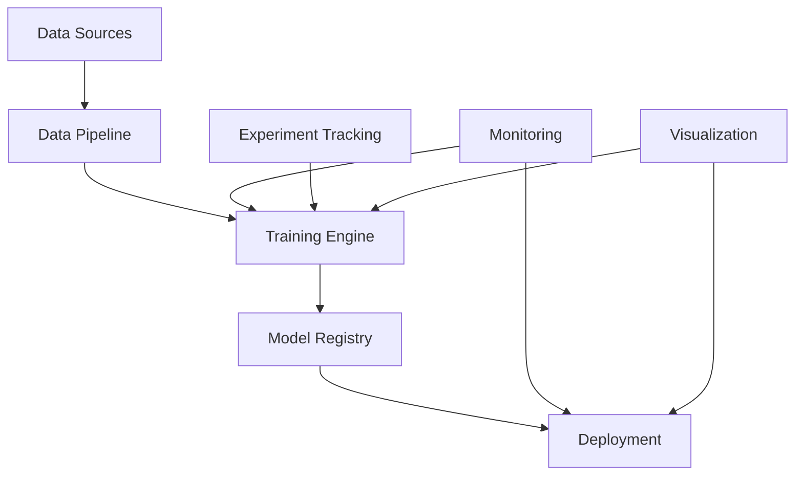

# docs/docs/index.md

# ML Training Framework

A comprehensive, production-ready PyTorch-based machine learning training framework designed for researchers, practitioners, and production deployments.

## 🚀 Features

### **Core Capabilities**

- **Multi-domain Support**: Computer Vision, NLP, GANs, and Reinforcement Learning
- **Advanced Architectures**: Modern CNN, Transformer, and Generative models
- **Production Ready**: Docker containers, CI/CD pipelines, monitoring
- **Research Friendly**: Jupyter notebooks, experiment tracking, visualization

### **Training & Optimization**

- **Distributed Training**: Multi-GPU and multi-node support
- **Advanced Optimizers**: Adam, AdamW, SGD with custom schedulers
- **Memory Efficient**: Gradient accumulation, mixed precision training
- **Experiment Tracking**: MLflow integration with metric logging

### **Data & Preprocessing**

- **Flexible Pipelines**: Custom datasets and data loaders
- **Augmentation**: Advanced computer vision and NLP augmentations
- **Streaming**: Large dataset handling with efficient data loading
- **Preprocessing**: Text tokenization, image transforms, feature engineering

### **Deployment & MLOps**

- **Containerized**: Docker support for all environments
- **Cloud Ready**: AWS, GCP, Kubernetes deployment configurations
- **Monitoring**: Prometheus, Grafana, TensorBoard integration
- **API Serving**: REST API for model inference and management

## 🏗️ Architecture

## 📊 Supported Model Types

| Domain                | Models                                   | Notebooks   |
| --------------------- | ---------------------------------------- | ----------- |
| **Computer Vision**   | ResNet, EfficientNet, Vision Transformer | 3 tutorials |
| **Natural Language**  | LSTM, GRU, Transformer, BERT-style       | 4 tutorials |
| **Generative Models** | GANs, VAEs, Diffusion                    | 2 tutorials |
| **Advanced Topics**   | Multi-modal, Meta-learning               | 2 tutorials |

## 🛠️ Technology Stack

### **Core Framework**

- **PyTorch**: Deep learning framework
- **NumPy**: Numerical computing
- **Pandas**: Data manipulation
- **Scikit-learn**: Machine learning utilities

### **Infrastructure**

- **Docker**: Containerization
- **MLflow**: Experiment tracking
- **TensorBoard**: Visualization
- **Prometheus/Grafana**: Monitoring

### **Development**

- **Jupyter**: Interactive development
- **pytest**: Testing framework
- **Black/flake8**: Code formatting
- **GitHub Actions**: CI/CD

## 📚 Learning Path

### **Fundamentals** (Notebooks 1-4)

1. [Tensor Operations](../notebooks/01_fundamentals/01_introduction_to_tensors.ipynb)
2. [Gradient Computation](../notebooks/01_fundamentals/02_gradient_computation.ipynb)
3. [Custom Autograd](../notebooks/01_fundamentals/03_custom_autograd_functions.ipynb)
4. [Backpropagation](../notebooks/01_fundamentals/04_backpropagation_visualization.ipynb)

### **Neural Networks** (Notebooks 5-7)

5. [MLP from Scratch](../notebooks/02_neural_networks/05_mlp_from_scratch.ipynb)
6. [Advanced Architectures](../notebooks/02_neural_networks/06_advanced_architectures.ipynb)
7. [Training Techniques](../notebooks/02_neural_networks/07_training_techniques.ipynb)

### **Specialized Domains** (Notebooks 8-16)

- **Computer Vision**: CNNs, modern architectures, projects
- **NLP**: RNNs, Transformers, sentiment analysis
- **Generative Models**: GANs, VAEs, advanced techniques

### **Production & Advanced** (Notebooks 17-25)

- **Optimization**: Model compression, quantization
- **Deployment**: APIs, monitoring, cloud deployment
- **Advanced Projects**: End-to-end applications

### **Capstone** (Notebooks 26-27)

- **Multimodal Systems**: Combined vision and language
- **Production MLOps**: Full deployment pipeline

## 🎯 Quick Links

=== "Get Started" - [Quick Start Guide](quickstart.md) - [Installation](quickstart.md#installation) - [First Training Run](quickstart.md#first-training)

=== "Examples" - [Code Examples](examples.md) - [Jupyter Notebooks](examples.md#notebooks) - [Sample Projects](examples.md#projects)

=== "API Reference" - [API Overview](api/index.md) - [Module Reference](api/reference.md) - [Training API](api/reference.md#training)

=== "Development" - [Contributing Guide](contributing.md) - [Development Setup](contributing.md#development-setup) - [Testing](contributing.md#testing)

## 💡 Use Cases

### **Research**

- Rapid prototyping of new architectures
- Experiment tracking and comparison
- Advanced visualization and analysis
- Reproducible research workflows

### **Education**

- Comprehensive learning notebooks
- Step-by-step tutorials
- Interactive examples
- Best practices demonstrations

### **Production**

- Scalable training pipelines
- Model serving and APIs
- Monitoring and alerting
- CI/CD integration

### **Industry Applications**

- Computer vision systems
- NLP applications
- Recommendation systems
- Time series forecasting

## 🌟 What's Next?

1. **[Quick Start](quickstart.md)** - Get up and running in 5 minutes
2. **[Examples](examples.md)** - Explore practical use cases
3. **[API Reference](api/index.md)** - Dive into the technical details
4. **[Contributing](contributing.md)** - Join the development

---

**Ready to build something amazing?** Start with our [Quick Start Guide](quickstart.md) or explore the [interactive examples](examples.md)!
